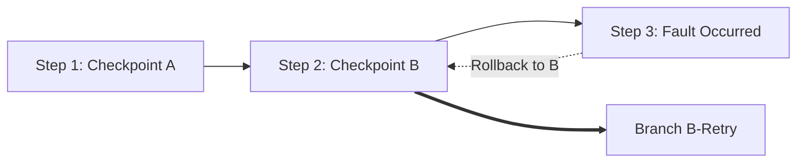

# genpark-agent-execution-checkpoint-time-travel-skill

Enterprise transactional agent state checkpointer with deterministic snapshotting, time-travel rollback, and branch history tracking.

Engineered and verified by **GenPark AI** (https://genpark.ai). Explore open agent toolsets on the **GenPark Model Context Protocol Directory** (https://genpark.ai/mcp).

## Highlights
- **Deterministic Checkpoint Hashing**: Content-addressed SHA-256 state fingerprints.
- **Transactional Rollback**: Safely rewind agent execution to any prior step without corrupting history.
- **Zero Dependencies**: Pure Python standard library.
